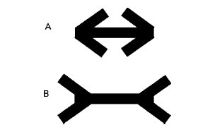
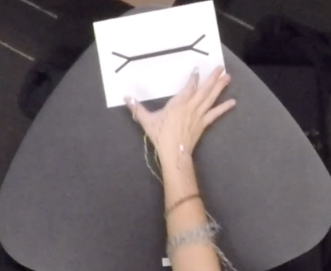
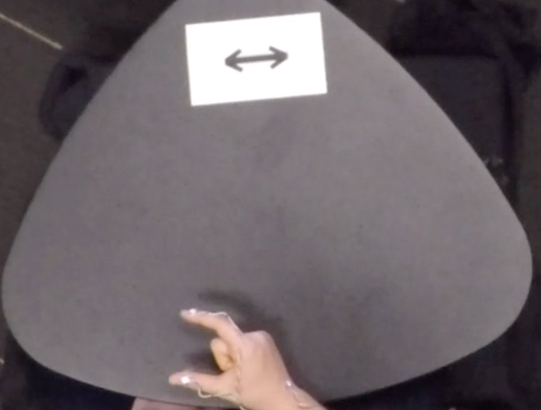
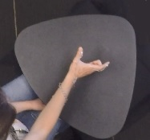

When the hands are used to communicate they are less suceptible to
illusion than when they are used to estimate.
================
Amanda Brown
September 16, 2020

### ABSTRACT

When we use our hands to estimate the size of sticks in the Müller-Lyer
illusion, we are highly susceptible to the illusion. But when we prepare
to act on sticks under the same conditions, we are significantly less
susceptible to the illusion. Here we ask whether our hands are
susceptible to illusion when used, not to act on objects, but to
describe them in spontaneous co-speech gestures or in conventional sign
languages of the Deaf. Thirty-two English-speakers and 13 ASL-signers
used their hands to act on, estimate, and describe sticks eliciting the
Müller-Lyer illusion. For both gesture and sign, the magnitude of
illusion for description was smaller than the magnitude of illusion for
estimation, and not different from the magnitude of illusion for action.
The mechanisms responsible for producing these non-codified gestures and
codified signs thus appear to operate, not on percepts involved in
estimation, but are rather derived from the way we act on objects.

### Muller-Lyer Illusion

 Figure 1. The Müller-Lyer illusion. A thin stick
is placed on the horizontal line. The closed configuration (closed fins)
makes the center line appear shorter than the open configuration (open
fins). In reality, the two center lines are the same length.

## METHOD

### Participants

Forty-five right-handed adults (ages 19-68 years, 23 female)
participated: 32 adults whose primary language is English were recruited
from the study pool at the University of Chicago; 13 adults whose
primary language is ASL were recruited at a local Deaf event or through
email advertisement (all 13 were deaf and learned ASL before the age of
6).

### Tasks and Procedure

Using motion capture technology, we recorded participants’ manual
movements as they performed tasks with four thin sticks of different
lengths (50mm, 70mm, 90mm, 110mm). Each stick was placed on a background
image that created the Müller-Lyer illusion, surrounding the stick with
open fins or closed fins (Fig.1; Goodale, Jakobson, & Keillor, 1994).
Participants were also presented with a set of sticks with no background
image (i.e., without fins). Thus, the procedure contained 12 displays,
presented in pseudorandom order and repeated 8 times in separate blocks
for each pf three tasks.

*Action Task.* Participants used their right hand to pick up the stick
in the display, holding it at the two ends, and immediately set it down
again on the table. They then returned their hand to the starting
position.

*Estimation Task.* Participants used their right hand to estimate the
length of the stick in the display using the thumb and forefinger,
maintaining the natural position of the wrist with hand on the table,
perpendicular to the stimulus.

*Description Task.* Participants watched a video of a hand holding a
20mm white disk tracing a unique path of motion over a neutral
background (approx. 5 seconds). When the video ended, participants were
instructed to close their eyes, and an experimenter placed the visual
display on the table in front of the participant. Participants were told
to open their eyes, pick up the stick in the display and perform the
movement they had seen in the video. Participants were then asked to
close their eyes again, and the experimenter removed the materials from
the table. When prompted, participants opened their eyes and described
the movements they just performed with the stick. Participants were
instructed to provide a description of the movement they had just
performed detailed enough that someone who did not see the movement
could perform it exactly as they had.

An example of the movement performed in the Description task, as well as
examples of the Action and Estimation tasks can be found on our OSF page
<https://osf.io/3rb6u/>.

### Analysis

We performed hierarchical linear modeling with the R package lme4
(Bates, Mächler, Bolker, & Walker, 2014). We fit a linear mixed-effects
model with maximum grip aperture (MGA) as the outcome variable, with
fixed effects of stick size, illusion display and task, and their
three-way interaction: maxGrip \~ stick \* fins \* task + (1 + stick \*
fins | subject). We fit a maximal random effects structure, which
includes random slopes for stick and fins and their interaction by
participant. We fit separate models with the same fixed and random
effects structure for ASL and co-speech gesture.

We obtained 2538 observations of grasping action, 1403 observations of
manual estimation and 1136 observations of gestured descriptions from
English speakers.

We obtained 954 observations of grasping action, 527 observations of
manual estimation and 442 observations of gestured descriptions from ASL
signers.

## RESULTS

To compare the results of our tasks, we examined two measures: (1) The
grip scaling slope, the relation between the MGA and the size of its
target object for the four stick lengths. This measure indicates how
accurately participants are capturing the increases in stick
sizes––positive slopes indicate that the handshape is increasing as
the lengths of the sticks increase. (2) The illusion effect, the
difference between grip apertures in the closed fins condition and the
open fins condition. This measure indicates how influenced participants
are by the illusion––a large difference indicates that the participants
are strongly influenced by the illusion. Figure 4 presents the linear
mixed-effects model predictions for the effects on maximum grip
apertures of stick size (grip scaling slope) and illusion background
(illusion effect) for signers (top) and speakers (bottom) in each of the
three tasks (Action, Description, Estimation).

### Action and Estimation

We obtained the expected contrast between grip apertures measured during
Action and Estimation tasks under illusion conditions. When grasping and
estimating the size of the objects, signers and speakers increased grip
apertures as the sticks increased in length, resulting in positive grip
scaling slopes. Confidence intervals for signers’ and speakers’ grip
scaling slopes overlap for action and for estimation. This finding
supports the conclusion that the grip scaling slopes (or rate of
increase in grip apertures as objects get bigger) for action and
estimation are not statistically different between signers and speakers.

For the illusion effect, signers and speakers used wider grip apertures
for sticks presented between open fins than for sticks presented between
closed fins when grasping the sticks and when estimating stick-length.
In addition, as in previous studies (Bruno & Franz, 2009), post-hoc
t-tests (Tukey corrected) confirmed that the size of the illusion effect
(i.e., the difference between grip apertures for open vs. closed fins)
was significantly greater in the Estimation task than in the Action task
for both signers and speakers. In other words, the effect of the
illusion on grip apertures was stronger when participants estimated the
size of the stick with their hands than when they reached to grasp the
stick, for both signers and speakers.

### Description

**Signers: American Sign Language.** When describing how they moved the
stick, signers used an increasingly large grip aperture as the sticks
increased in length, resulting in a positive grip scaling slope.
However, post-hoc t-tests revealed that the grip scaling slope was
significantly smaller in the Description task than in the Action and
Estimation tasks. In other words, signers did not increase their grip
apertures for larger sticks in the Description task as much as they did
in the Action and Estimation tasks. Nevertheless, their slope was
positive, indicating that their handshapes did capture the increasing
stick lengths.

    ## $emtrends
    ##  type        stickcmCentered.trend    SE   df lower.CL upper.CL
    ##  DESCRIPTION                  4.79 0.367 24.3     4.03     5.55
    ##  ESTIMATION                   8.93 0.350 21.1     8.20     9.66
    ##  ACTION                       6.96 0.319 14.4     6.27     7.64
    ## 
    ## Results are averaged over the levels of: fins 
    ## Degrees-of-freedom method: kenward-roger 
    ## Confidence level used: 0.95 
    ## 
    ## $contrasts
    ##  contrast                 estimate    SE   df t.ratio p.value
    ##  DESCRIPTION - ESTIMATION    -4.14 0.327 1878 -12.658 <.0001 
    ##  DESCRIPTION - ACTION        -2.17 0.288 1880  -7.522 <.0001 
    ##  ESTIMATION - ACTION          1.97 0.274 1877   7.201 <.0001 
    ## 
    ## Results are averaged over the levels of: fins 
    ## Degrees-of-freedom method: kenward-roger 
    ## P value adjustment: tukey method for comparing a family of 3 estimates

With respect to the illusion effect, signers used wider grip apertures
for sticks between open fins than for sticks between closed fins when
describing what they did with the stick. However, post-hoc tests
revealed that the effect of the illusion on Descriptions was
significantly different from, and smaller than, the effect of the
illusion on Estimations and not significantly different from the effect
of the illusion on Actions.

    ## type = DESCRIPTION:
    ##  contrast estimate    SE    df lower.CL upper.CL
    ##  linear       2.85 1.117 113.7    0.638     5.06
    ## 
    ## type = ESTIMATION:
    ##  contrast estimate    SE    df lower.CL upper.CL
    ##  linear      10.22 1.010 108.3    8.216    12.22
    ## 
    ## type = ACTION:
    ##  contrast estimate    SE    df lower.CL upper.CL
    ##  linear       2.31 0.773  34.4    0.739     3.88
    ## 
    ## Degrees-of-freedom method: kenward-roger 
    ## Confidence level used: 0.95

    ## type = DESCRIPTION:
    ##  contrast estimate    SE    df t.ratio p.value
    ##  linear       2.85 1.117 113.7  2.552  0.0120 
    ## 
    ## type = ESTIMATION:
    ##  contrast estimate    SE    df t.ratio p.value
    ##  linear      10.22 1.010 108.3 10.119  <.0001 
    ## 
    ## type = ACTION:
    ##  contrast estimate    SE    df t.ratio p.value
    ##  linear       2.31 0.773  34.4  2.987  0.0052 
    ## 
    ## Degrees-of-freedom method: kenward-roger

<!-- -->

**Speakers: Co-speech gesture.** When describing how they moved the
stick, speakers also used an increasingly large grip aperture in their
co-speech gestures as the sticks increased in length, resulting in a
positive grip scaling slope. As for signers, the grip scaling slope for
speakers was significantly smaller in the Description task than in the
Action and Estimation tasks.

    ## $emtrends
    ##  type        stickcmCentered.trend    SE  df asymp.LCL asymp.UCL
    ##  DESCRIPTION                  1.92 0.190 Inf      1.55       2.3
    ##  ESTIMATION                   8.35 0.179 Inf      7.99       8.7
    ##  ACTION                       7.10 0.158 Inf      6.79       7.4
    ## 
    ## Results are averaged over the levels of: fins 
    ## Degrees-of-freedom method: asymptotic 
    ## Confidence level used: 0.95 
    ## 
    ## $contrasts
    ##  contrast                 estimate    SE  df z.ratio p.value
    ##  DESCRIPTION - ESTIMATION    -6.42 0.194 Inf -33.101 <.0001 
    ##  DESCRIPTION - ACTION        -5.17 0.173 Inf -29.881 <.0001 
    ##  ESTIMATION - ACTION          1.25 0.161 Inf   7.773 <.0001 
    ## 
    ## Results are averaged over the levels of: fins 
    ## Degrees-of-freedom method: asymptotic 
    ## P value adjustment: tukey method for comparing a family of 3 estimates

With respect to the illusion effect, speakers used slightly wider grip
apertures for sticks between open fins than for sticks between closed
fins in the co-speech gestures they produced when describing what they
did with the stick.); this difference was not statistically significant.
As in signers’ descriptions, post-hoc t-tests confirmed that the effect
of the illusion on Descriptions was significantly different from, and
smaller than, the effect of the illusion on Estimations and not
significantly different from the effect of the illusion on Actions.

    ## type = DESCRIPTION:
    ##  contrast estimate    SE  df asymp.LCL asymp.UCL
    ##  linear      0.721 0.661 Inf    -0.574      2.02
    ## 
    ## type = ESTIMATION:
    ##  contrast estimate    SE  df asymp.LCL asymp.UCL
    ##  linear      7.537 0.598 Inf     6.365      8.71
    ## 
    ## type = ACTION:
    ##  contrast estimate    SE  df asymp.LCL asymp.UCL
    ##  linear      1.138 0.459 Inf     0.238      2.04
    ## 
    ## Degrees-of-freedom method: asymptotic 
    ## Confidence level used: 0.95

    ## type = DESCRIPTION:
    ##  contrast estimate    SE  df z.ratio p.value
    ##  linear      0.721 0.661 Inf  1.091  0.2754 
    ## 
    ## type = ESTIMATION:
    ##  contrast estimate    SE  df z.ratio p.value
    ##  linear      7.537 0.598 Inf 12.599  <.0001 
    ## 
    ## type = ACTION:
    ##  contrast estimate    SE  df z.ratio p.value
    ##  linear      1.138 0.459 Inf  2.479  0.0132 
    ## 
    ## Degrees-of-freedom method: asymptotic

<!-- -->

Below you can see the contrasts in grip scaling slope and illusion
effect by group and task.

<!-- -->

### Illusion effects as a function of grip scaling slope.

We compared speakers and signers directly on the Description task alone,
examining the fixed effects of Language on grip scaling slopes (maxGrip
\~ stick \* fins \* language + (1 + stick \* fins | subject). Regression
analyses confirmed that the grip scaling slope for description was
significantly steeper for signers than for speakers indicating that
speakers were less good at capturing the actual size of the largest
sticks in their manual descriptions, although on average they did
reliably capture the relative sizes of the sticks.

It may be difficult to detect an illusion effect if descriptions do not
capture the increasing lengths of the sticks. To explore this
possibility, we assessed the illusion effect for each participant as a
function of the grip scaling slope that the participant produced when
there was no illusion display (i.e., when the sticks were presented
without any fins). The above graph presents each participant’s
sensitivity to stick length, measured by grip scaling slope in a neutral
context (sticks presented without fins, x-axis) in relation to that
participant’s sensitivity to illusory size cues, measured by illusion
effect (difference in grip apertures for the closed versus open illusion
displays, y-axis) for signers (in red) and speakers (in blue).

<!-- --> Note that
signers’ grip scaling slopes in a neutral context are larger than
speakers’; indeed, there is no overlap between the groups. Moreover,
signers displayed the same illusion effect no matter how steep their
grip scaling slope––results of the Pearson’s correlation demonstrate
that the grip scaling slopes and illusion effects for signers are not
significantly correlated (r(8)=.25, p=.48), suggesting that grip scaling
slope and illusion effect are independent in signers.

<!-- -->

In contrast, we see a positive relation between participant grip scaling
slope in a neutral context and size of the illusion effect in speakers’
co-speech gestures––the steeper the slope, the bigger the illusion
effect (r(30)=.43, p=.015).

    ## 
    ## Call:
    ## lm(formula = slope ~ illusion, data = Speakers_Compare_Gest)
    ## 
    ## Residuals:
    ##      Min       1Q   Median       3Q      Max 
    ## -0.77136 -0.11508  0.02052  0.14851  0.46101 
    ## 
    ## Coefficients:
    ##             Estimate Std. Error t value Pr(>|t|)    
    ## (Intercept)  1.41286    0.05643  25.038   <2e-16 ***
    ## illusion     0.05592    0.02173   2.573   0.0153 *  
    ## ---
    ## Signif. codes:  0 '***' 0.001 '**' 0.01 '*' 0.05 '.' 0.1 ' ' 1
    ## 
    ## Residual standard error: 0.2932 on 30 degrees of freedom
    ## Multiple R-squared:  0.1808, Adjusted R-squared:  0.1535 
    ## F-statistic: 6.623 on 1 and 30 DF,  p-value: 0.01526

    ##                  2.5 %    97.5 %
    ## (Intercept) 1.29761911 1.5281008
    ## illusion    0.01154117 0.1002921

    ## Parameter   | Coefficient (std.) |     1e+02% CI
    ## ------------------------------------------------
    ## (Intercept) |          -8.98e-17 | [-0.33, 0.33]
    ## illusion    |               0.43 | [ 0.09, 0.76]
    ## 
    ## # Standardization method: Refit

    ## 
    ##  Pearson's product-moment correlation
    ## 
    ## data:  Speakers_Compare_Gest$slope and Speakers_Compare_Gest$illusion
    ## t = 2.5734, df = 30, p-value = 0.01526
    ## alternative hypothesis: true correlation is not equal to 0
    ## 95 percent confidence interval:
    ##  0.08987639 0.67399726
    ## sample estimates:
    ##       cor 
    ## 0.4252435

    ## 
    ## Call:
    ## lm(formula = slope ~ illusion, data = Signers_Compare_Gest)
    ## 
    ## Residuals:
    ##    Min     1Q Median     3Q    Max 
    ## -2.814 -1.391 -0.848  1.305  5.190 
    ## 
    ## Coefficients:
    ##             Estimate Std. Error t value Pr(>|t|)
    ## (Intercept)   2.2748     3.8042   0.598    0.566
    ## illusion      0.9178     1.2299   0.746    0.477
    ## 
    ## Residual standard error: 2.539 on 8 degrees of freedom
    ## Multiple R-squared:  0.06508,    Adjusted R-squared:  -0.05178 
    ## F-statistic: 0.5569 on 1 and 8 DF,  p-value: 0.4769

    ##                 2.5 %    97.5 %
    ## (Intercept) -6.497685 11.047256
    ## illusion    -1.918359  3.754014

    ## Parameter   | Coefficient (std.) |     1e+02% CI
    ## ------------------------------------------------
    ## (Intercept) |          -3.17e-16 | [-0.75, 0.75]
    ## illusion    |               0.26 | [-0.53, 1.04]
    ## 
    ## # Standardization method: Refit

    ## 
    ##  Pearson's product-moment correlation
    ## 
    ## data:  Signers_Compare_Gest$slope and Signers_Compare_Gest$illusion
    ## t = 0.74625, df = 8, p-value = 0.4769
    ## alternative hypothesis: true correlation is not equal to 0
    ## 95 percent confidence interval:
    ##  -0.4461838  0.7622939
    ## sample estimates:
    ##       cor 
    ## 0.2551105

To summarize, our goal was to determine how spontaneous descriptions
that signers and speakers produce with their hands compare to the
actions and estimations they produce with their hands in the same
context, focusing on two features: (1) how well the hand reflects
properties of the object; in this case, increasing stick length––grip
scaling slope, and (2) how susceptible the hand is to perceptual
illusion; in this case, the Müller-Lyer illusion––the illusion effect.
With respect to grip scaling slope, we found that both signers and
speakers capture increasing stick length in their hands better in the
Action and Estimation tasks than in the Description task, although both
groups do capture relative stick length to some degree in their
descriptions. With respect to the illusion effect, we first replicated
previous work in speakers showing that the hands are more susceptible to
the Müller-Lyer illusion when they estimate stick length than when they
reach to act on the same sticks, and we extended this effect to signers.
Moreover, we found that the magnitude of the illusion effect in
descriptions was significantly different from the magnitude of the
illusion effect in estimations, and not significantly different from the
magnitude of the illusion effect in actions. Both signers and speakers
showed this pattern, but signers were better at capturing stick length
than speakers.
