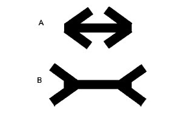
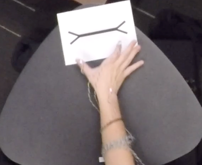
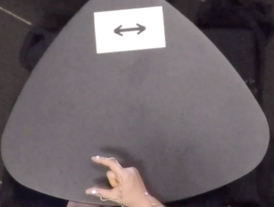
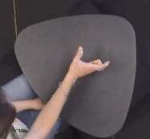

### ABSTRACT

When we use our hands to estimate the size of sticks in the Müller-Lyer illusion, we are highly susceptible to the illusion. But when we prepare to act on sticks under the same conditions, we are significantly less susceptible to the illusion. Here we ask whether our hands are susceptible to illusion when used, not to act on objects, but to describe them in spontaneous co-speech gestures or in conventional sign languages of the Deaf. Thirty-two English-speakers and 13 ASL-signers used their hands to act on, estimate, and describe sticks eliciting the Müller-Lyer illusion. For both gesture and sign, the magnitude of illusion for description was smaller than the magnitude of illusion for estimation, and not different from the magnitude of illusion for action. The mechanisms responsible for producing these non-codified gestures and codified signs thus appear to operate, not on percepts involved in estimation, but are rather derived from the way we act on objects.

```{r setup, include=FALSE, message=FALSE, warning=FALSE}
knitr::opts_chunk$set(echo = FALSE)

#Load packages
library(tidyverse)
library(lme4)
library(nlme)
library(lsmeans)
library(emmeans)
library(EMAtools)
library(lmerTest)
library(effects)
library(effectsize)
library(plotly)

#Import Data 
#Function to find and import files
import_files_fins <- function(string) {
  files <- dir("../data/", pattern = paste(string), full.names = T)
  map(files, read_csv) %>%
    bind_rows() %>%
    type_convert() %>%
    filter(fins != "none") %>%
    mutate(Lcat = paste(string), fins = factor(fins), type = factor(type))%>%
    mutate(type=recode(type, GESTURE = "DESCRIPTION"))
}
#string <- "ASL"
#Import Files with open/closed fins
ASL_fins <- import_files_fins("ASL")
getwd()
ENG_fins <- import_files_fins("ENG") 
Both_fins <- bind_rows(ASL_fins, ENG_fins)%>%
  mutate(Lcat=recode(Lcat, ASL="Signers", ENG="Speakers"))

#Function to find and import files: data with no illusion conditions
import_files_none <- function(string) {
  files <<- dir("../data/", pattern = string, full.names = TRUE)
  map(files, read_csv) %>%
    bind_rows() %>%
    type_convert() %>%
    filter(fins == "none") %>%
    mutate(Lcat = string, fins = factor(fins), type = factor(type))%>%
    mutate(type=recode(type, GESTURE = "DESCRIPTION"))
}


#Import Files with no fins
ASL_none <- import_files_none("ASL")
ENG_none <- import_files_none("ENG") 
Both_none <- bind_rows(ASL_none, ENG_none)
Both_none <- Both_none %>%
  mutate(Lcat=recode(Lcat, ASL="Signers", ENG="Speakers"))

```

### Muller-Lyer Illusion



Figure 1. The Müller-Lyer illusion.  A thin stick is placed on the horizontal line. The closed configuration (closed fins) makes the center line appear shorter than the open configuration (open fins). In reality, the two center lines are the same length. 


## METHOD

### Participants
Forty-five right-handed adults (ages 19-68 years, 23 female) participated: 32 adults whose primary language is English were recruited from the study pool at the University of Chicago; 13 adults whose primary language is ASL were recruited at a local Deaf event or through email advertisement (all 13 were deaf and learned ASL before the age of 6). 

### Tasks and Procedure
Using motion capture technology, we recorded participants’ manual movements as they performed tasks with four thin sticks of different lengths (50mm, 70mm, 90mm, 110mm). Each stick was placed on a background image that created the Müller-Lyer illusion, surrounding the stick with open fins or closed fins (Fig.1; Goodale, Jakobson, & Keillor, 1994). Participants were also presented with a set of sticks with no background image (i.e., without fins). Thus, the procedure contained 12 displays, presented in pseudorandom order and repeated 8 times in separate blocks for each pf three tasks. 

*Action Task.* Participants used their right hand to pick up the stick in the display, holding it at the two ends, and immediately set it down again on the table. They then returned their hand to the starting position. 



*Estimation Task.*  Participants used their right hand to estimate the length of the stick in the display using the thumb and forefinger, maintaining the natural position of the wrist with hand on the table, perpendicular to the stimulus.



*Description Task.*  Participants watched a video of a hand holding a 20mm white disk tracing a unique path of motion over a neutral background (approx. 5 seconds). When the video ended, participants were instructed to close their eyes, and an experimenter placed the visual display on the table in front of the participant. Participants were told to open their eyes, pick up the stick in the display and perform the movement they had seen in the video. Participants were then asked to close their eyes again, and the experimenter removed the materials from the table. When prompted, participants opened their eyes and described the movements they just performed with the stick. Participants were instructed to provide a description of the movement they had just performed detailed enough that someone who did not see the movement could perform it exactly as they had.



An example of the movement performed in the Description task, as well as examples of the Action and Estimation tasks can be found on our OSF page [https://osf.io/3rb6u/](https://osf.io/3rb6u/).

### Analysis
We performed hierarchical linear modeling with the R package lme4 (Bates, Mächler, Bolker, & Walker, 2014). We fit a linear mixed-effects model with maximum grip aperture (MGA) as the outcome variable, with fixed effects of stick size, illusion display and task, and their three-way interaction: maxGrip ~ stick * fins * task + (1 + stick * fins | subject). We fit a maximal random effects structure, which includes random slopes for stick and fins and their interaction by participant. We fit separate models with the same fixed and random effects structure for ASL and co-speech gesture.

We obtained `r nrow(ENG_fins[ ENG_fins$type == "ACTION", ])` observations of grasping action, `r nrow(ENG_fins[ ENG_fins$type == "ESTIMATION", ])` observations of manual estimation and `r nrow(ENG_fins[ ENG_fins$type == "DESCRIPTION", ])` observations of gestured descriptions from English speakers. 

We obtained `r nrow(ASL_fins[ ASL_fins$type == "ACTION", ])` observations of grasping action, `r nrow(ASL_fins[ ASL_fins$type == "ESTIMATION", ])` observations of manual estimation and `r nrow(ASL_fins[ ASL_fins$type == "DESCRIPTION", ])` observations of gestured descriptions from ASL signers.

## RESULTS
To compare the results of our tasks, we examined two measures: (1) The grip scaling slope, the relation between the MGA and the size of its target object for the four stick lengths. This measure indicates how accurately participants are capturing the increases in stick sizes––positive slopes indicate that the handshape is increasing as the lengths of the sticks increase. (2) The illusion effect, the difference between grip apertures in the closed fins condition and the open fins condition. This measure indicates how influenced participants are by the illusion––a large difference indicates that the participants are strongly influenced by the illusion. Figure 4 presents the linear mixed-effects model predictions for the effects on maximum grip apertures of stick size (grip scaling slope) and illusion background (illusion effect) for signers (top) and speakers (bottom) in each of the three tasks (Action, Description, Estimation). 

### Action and Estimation

We obtained the expected contrast between grip apertures measured during Action and Estimation tasks under illusion conditions. When grasping and estimating the size of the objects, signers and speakers increased grip apertures as the sticks increased in length, resulting in positive grip scaling slopes. Confidence intervals for signers’ and speakers’ grip scaling slopes overlap for action and for estimation. This finding supports the conclusion that the grip scaling slopes (or rate of increase in grip apertures as objects get bigger) for action and estimation are not statistically different between signers and speakers.

For the illusion effect, signers and speakers used wider grip apertures for sticks presented between open fins than for sticks presented between closed fins when grasping the sticks and when estimating stick-length. In addition, as in previous studies (Bruno & Franz, 2009), post-hoc t-tests (Tukey corrected) confirmed that the size of the illusion effect (i.e., the difference between grip apertures for open vs. closed fins) was significantly greater in the Estimation task than in the Action task for both signers and speakers. In other words, the effect of the illusion on grip apertures was stronger when participants estimated the size of the stick with their hands than when they reached to grasp the stick, for both signers and speakers.

### Description

**Signers: American Sign Language.** When describing how they moved the stick, signers used an increasingly large grip aperture as the sticks increased in length, resulting in a positive grip scaling slope. However, post-hoc t-tests revealed that the grip scaling slope was significantly smaller in the Description task than in the Action and Estimation tasks. In other words, signers did not increase their grip apertures for larger sticks in the Description task as much as they did in the Action and Estimation tasks. Nevertheless, their slope was positive, indicating that their handshapes did capture the increasing stick lengths.

```{r signers_model_slope, warning=FALSE, message=FALSE}

compare3_tasks <- function(data, string) {
  #data$type <- factor(data$type, levels = c("DESCRIPTION", "ACTION", "ESTIMATION"))
  data$type <- factor(data$type, levels = c("DESCRIPTION", "ESTIMATION", "ACTION"))
  #data$fins <- factor(data$fins, levels = c("open", "closed"))
  data$fins <- factor(data$fins, levels = c("closed", "open"))
  input <<- data
  mod_Task <<- lme4::lmer(maxGrip ~ stickcmCentered * fins*type + (1 + stickcmCentered * fins | obsisSubj), data = input)
  results <<- summary(mod_Task)
}

compare3_tasks(ASL_fins, "Signers")
first <- emmeans(mod_Task, pairwise ~ fins | type)
emtrends(mod_Task, pairwise ~ type, var="stickcmCentered")
```

With respect to the illusion effect, signers used wider grip apertures for sticks between open fins than for sticks between closed fins when describing what they did with the stick. However, post-hoc tests revealed that the effect of the illusion on Descriptions was significantly different from, and smaller than, the effect of the illusion on Estimations and not significantly different from the effect of the illusion on Actions.

```{r signers_model_fins, warning=FALSE, message=FALSE}
confint(contrast(first[[1]], "poly"))

contrast(first[[1]], "poly")
```

```{r signers_graph_contrasts, warning=FALSE, message=FALSE}
emmip(mod_Task, stickcmCentered ~ fins |type)
```

**Speakers: Co-speech gesture.** When describing how they moved the stick, speakers also used an increasingly large grip aperture in their co-speech gestures as the sticks increased in length, resulting in a positive grip scaling slope. As for signers, the grip scaling slope for speakers was significantly smaller in the Description task than in the Action and Estimation tasks.

```{r speakers_model_slopes, message=FALSE, warning=FALSE}
knitr::opts_chunk$set(echo = FALSE)

compare3_tasks(ENG_fins, "Speakers")
first <- emmeans(mod_Task, pairwise ~ fins | type)
emtrends(mod_Task, pairwise ~ type, var="stickcmCentered")

```
```{r pred_function, include=FALSE}
#Function for model fitting
pred <- function(fitModel) {
  
  # create a data frame with various levels represented

  
    vars <- stringr::str_split(as.character(fitModel@call$formula), stringr::fixed(" "))
  outcomeVarName <- vars[[2]]
  allPredictors <- attributes(stats::terms(fitModel@call$formula))$term.labels
  isInteraction <- stringr::str_detect(attributes(stats::terms(fitModel@call$formula))$term.labels, ":")
  isLevel <- stringr::str_detect(attributes(stats::terms(fitModel@call$formula))$term.labels, "\\|")
  predictorVars <- subset(allPredictors, !isInteraction & !isLevel)
  levelVars <- subset(allPredictors, isLevel)
  levelVars <- stringr::str_replace(levelVars, ".* \\| ", "") # remove all slope levels
  
  
  newdat <- fitModel@frame
  newdat[,outcomeVarName] <- NA
  newdat <- unique(newdat)
  
  # generate model values
  mm<-stats::model.matrix(stats::terms(fitModel),newdat)
  
  # generate predictions
  newdat[,outcomeVarName] <- (mm %*% lme4::fixef(fitModel))
  
  # generate variance from the fixed effects (add in random effects?)
  newdat$pvar1 <- diag(mm %*% tcrossprod(stats::vcov(fitModel),mm))
  
  # add the random effects into the estimate
  for(var in levelVars){
    #     print(ranef(fitModel)[[var]][as.character(newdat[,var]),'(Intercept)'])
    newdat[,outcomeVarName] <- newdat[,outcomeVarName]+lme4::ranef(fitModel)[[var]][as.character(newdat[,var]),'(Intercept)']
    
  }
  
  # make high and low estimates
  newdat <- data.frame(
    newdat
    , plo = newdat[,outcomeVarName]-2*sqrt(newdat$pvar1)
    , phi = newdat[,outcomeVarName]+2*sqrt(newdat$pvar1)
  )
  
  # collapse groups that are irrelevant using ddply(...,summarise,...) (ver_letter removed!)
  
  eval(parse(text = paste0("data.modeled <- plyr::ddply(newdat, predictorVars, plyr::summarise, ", outcomeVarName, " = mean(", outcomeVarName,"), plo=mean(plo), phi=mean(phi))")))
}

```
With respect to the illusion effect, speakers used slightly wider grip apertures for sticks between open fins than for sticks between closed fins in the co-speech gestures they produced when describing what they did with the stick; this difference was not statistically significant. As in signers’ descriptions, post-hoc t-tests confirmed that the effect of the illusion on Descriptions was significantly different from, and smaller than, the effect of the illusion on Estimations and not significantly different from the effect of the illusion on Actions.

```{r speakers_model_fins, warning=FALSE, message=FALSE}
confint(contrast(first[[1]], "poly"))

contrast(first[[1]], "poly")

```
```{r speakers_graph_contrasts, warning=FALSE, message=FALSE}
emmip(mod_Task, stickcmCentered ~ fins |type)
```

Below you can see the contrasts in grip scaling slope and illusion effect by group and task.

```{r all_graph, warning=FALSE, message=FALSE}
compare3_tasks_graphs <- function(data, string) {
  data$type <- factor(data$type, levels = c("DESCRIPTION", "ACTION", "ESTIMATION"))
  input <<- data
  mod_Task <<- lme4::lmer(maxGrip ~ stickcmCentered * fins*type + (1 + stickcmCentered * fins | obsisSubj), data = input)
  
  eff_Task <<- effect(c("stickcmCentered:fins:type"), mod_Task)
}

compare3_tasks_graphs(ENG_fins, "Speakers")

eff_Task_sp <- as.data.frame(eff_Task) %>%
  mutate(Lcat = "Speakers")


compare3_tasks_graphs(ASL_fins, "Signers")

eff_Task_si <-as.data.frame(eff_Task) %>%
  mutate(Lcat = "Signers")


all_graph <- ggplot() +
  geom_line(as.data.frame(eff_Task_si), mapping = aes(x=(stickcmCentered+8)*10, y=fit, linetype=fins, color=fins))+
  geom_line(as.data.frame(eff_Task_sp), mapping = aes(x=(stickcmCentered+8)*10, y=fit, linetype=fins, color=fins))+
  geom_jitter(Both_fins, mapping = aes(x = stickcm*10, y = maxGrip, shape=fins, color=fins), size= 0.3, alpha = .18)+
  labs(title = "The Effect of Task on Grip Apertures in the Illusion Context", x="stick size (mm)", y="the maximum grip aperture (mm)") +
  facet_grid(Lcat ~ type)+
  theme_minimal()+
  theme(legend.title = element_blank())+
  theme(panel.spacing = unit(1, "lines"))+
  ylim(30, 150)
  
gpbw <- ggplotly(all_graph, width=640, height=800)%>%
  style(showlegend = FALSE, traces = 2:23)%>%
  style(name = "closed", traces = 1)%>%
  style(showlegend = TRUE, name = "open", traces = 4)%>%
  config(displayModeBar = F)%>%
  layout(annotations=list(x=-1))%>%
  add_annotations(text="fins", xref="paper", yref="paper",
                   x=1.05, xanchor="left",
                   y=0.5, yanchor="bottom",    # Same y as legend below
                   legendtitle=TRUE, showarrow=FALSE ) %>%
  layout(legend=list(x=1.05, y=0.5, yanchor="top"))
gpbw[['x']][['layout']][['annotations']][[2]][['x']] <- -0.05
gpbw
```

### Illusion effects as a function of grip scaling slope. 

We compared speakers and signers directly on the Description task alone, examining the fixed effects of Language on grip scaling slopes (maxGrip ~ stick * fins * language + (1 + stick * fins | subject). Regression analyses confirmed that the grip scaling slope for description was significantly steeper for signers than for speakers indicating that speakers were less good at capturing the actual size of the largest sticks in their manual descriptions, although on average they did reliably capture the relative sizes of the sticks. 

It may be difficult to detect an illusion effect if descriptions do not capture the increasing lengths of the sticks. To explore this possibility, we assessed the illusion effect for each participant as a function of the grip scaling slope that the participant produced when there was no illusion display (i.e., when the sticks were presented without any fins). The above graph presents each participant’s sensitivity to stick length, measured by grip scaling slope in a neutral context (sticks presented without fins, x-axis) in relation to that participant’s sensitivity to illusory size cues, measured by illusion effect (difference in grip apertures for the closed versus open illusion displays, y-axis) for signers (in red) and speakers (in blue).

```{r slopes_by_fins, warning=FALSE, message=FALSE}
slope_function <- function(data, string, group){
  name <<- paste0(group, "_", string)
  input <<- filter(data, type == string)
  mod_Gesture1 <<- lme4::lmer(maxGrip ~ stickcmCentered * fins + (1 + stickcmCentered * fins | obsisSubj), data = input)
  summary(mod_Gesture1)
  coef(summary(mod_Gesture1))
  fix <- fixef(mod_Gesture1)
  #print(c(fix[2], fix[3]))
  slopes <- ranef(mod_Gesture1)
  slopes <- as.data.frame(slopes$obsisSubj)
  slopes$obsisSubj <- rownames(slopes)
  slopes$stick <- slopes$stickcmCentered + fix[2]
  slopes$illusion <- slopes$finsopen + fix[3]
  slopes$task <- string
  assign(quo_name(enquo(name)), slopes, envir=.GlobalEnv)
}

Speakers_GESTURE <- slope_function(ENG_fins, "DESCRIPTION", "Speakers")
Speakers_ACTION <- slope_function(ENG_fins, "ACTION", "Speakers")
Speakers_ESTIMATION <- slope_function(ENG_fins, "ESTIMATION", "Speakers")

Signers_GESTURE <- slope_function(ASL_fins, "DESCRIPTION", "Signers")
Signers_ACTION <- slope_function(ASL_fins, "ACTION", "Signers")
Signers_ESTIMATION <- slope_function(ASL_fins, "ESTIMATION", "Signers")

Signers <- rbind(Signers_ACTION, Signers_ESTIMATION, Signers_GESTURE)
Speakers <- rbind(Speakers_ACTION, Speakers_ESTIMATION, Speakers_GESTURE)

####Function for slopes predicted by no illusion####
slope_function_none <- function(data, string, group){
  name <<- paste0(group, "_", string)
  col_name <- enquo(name)
  input <- filter(data, type == string)
  mod_Gesture1 <<- lme4::lmer(maxGrip ~ stickcmCentered + (1 + stickcmCentered | obsisSubj), data = input)
  summary(mod_Gesture1)
  coef(summary(mod_Gesture1))
  fix <- fixef(mod_Gesture1)
  #print(fix[2])
  slopes <- ranef(mod_Gesture1)
  slopes <- as.data.frame(slopes$obsisSubj)
  slopes$obsisSubj <- rownames(slopes)
  slopes$slope <- slopes$stickcmCentered + fix[2]
  slopes$task <- string
  assign(quo_name(enquo(name)), slopes, envir=.GlobalEnv)
}

ENG_none_GESTURE <- slope_function_none(ENG_none, "DESCRIPTION", "ENG_none")
ENG_none_ACTION <- slope_function_none(ENG_none, "ACTION", "ENG_none")
ENG_none_ESTIMATION <- slope_function_none(ENG_none, "ESTIMATION", "ENG_none")

ASL_none_GESTURE <- slope_function_none(ASL_none, "DESCRIPTION", "ASL_none")
ASL_none_ACTION <- slope_function_none(ASL_none, "ACTION", "ASL_none")
ASL_none_ESTIMATION <- slope_function_none(ASL_none, "ESTIMATION", "ASL_none")

ENG_none_slopes <- rbind(ENG_none_ACTION, ENG_none_ESTIMATION, ENG_none_GESTURE)
ASL_none_slopes <- rbind(ASL_none_ACTION, ASL_none_ESTIMATION, ASL_none_GESTURE)


Signers_All <- Signers %>%
  left_join(ASL_none_slopes, by = c("obsisSubj", "task")) %>%
  mutate(LCAT = "Signers")


Speakers_All <- Speakers %>%
  left_join(ENG_none_slopes, by = c("obsisSubj", "task")) %>%
  mutate(LCAT = "Speakers")

All_data <- rbind(Speakers_All, Signers_All)

graph_function_task <- function(task){
  task_text <- enquo(task)
  slope_graph <- All_data %>%
    filter(task == !!task_text) %>%
    ggplot(aes(x=slope, y=illusion))+
    geom_point(aes(color = LCAT)) +
    geom_smooth(method = "lm", aes(color = LCAT))+
    scale_color_discrete(name = "Group")  +
    labs(title = paste("Relation of grip aperture slopes \n to illusion effect by participant:", task), x = "Participant Grip Scaling Slope in a Neutral Context (mm)", y ="Participant Illusion effect (mm)")
  return (slope_graph)
}

slope_graph <- graph_function_task("DESCRIPTION")
#slope_graph # + labs(title ="Relation of grip aperture slopes \n to illusion effect by participant:DESCRIPTION")

sd <- ggplotly(slope_graph) %>%
  layout(legend = list(x=1, y=.5))
sd[['x']][['layout']][['annotations']][[1]][['y']] <- .6
sd
```
  Note that signers’ grip scaling slopes in a neutral context are larger than speakers’; indeed, there is no overlap between the groups. Moreover, signers displayed the same illusion effect no matter how steep their grip scaling slope––results of the Pearson’s correlation demonstrate that the grip scaling slopes and illusion effects for signers are not significantly correlated (r(8)=.25, p=.48), suggesting that grip scaling slope and illusion effect are independent in signers.

```{r speakers_only_slope_by_fins, warning=FALSE, message=FALSE}
###graphing by group###
slope_graph <- All_data %>%
  filter(LCAT == "Speakers", task == "DESCRIPTION") %>%
  ggplot(aes(x=slope, y=illusion))+
  geom_point(aes(color = task)) +
  geom_smooth(method = "lm", aes(color = task))+
  labs(title = paste("Relation of grip aperture slopes to illusion effect: Speakers"), 
       x = "Participant Grip Scaling Slope for Descriptions in a Neutral Context (mm)", y = "Participant Illusion effect")+
  scale_color_manual(labels = c("DESCRIPTION"), values = "#00BFC4")

sg <- ggplotly(slope_graph)%>%
  layout(showlegend = F)
sg
```

In contrast, we see a positive relation between participant grip scaling slope in a neutral context and size of the illusion effect in speakers’ co-speech gestures––the steeper the slope, the bigger the illusion effect (r(30)=.43, p=.015). 


```{r slope_by_fins_corr, warning=FALSE, message=FALSE}
Speakers_Compare_Gest <- Speakers_All %>%
  dplyr::filter(task == "DESCRIPTION")

Signers_Compare_Gest <- Signers_All %>%
  dplyr::filter(task == "DESCRIPTION")

mod1 <- lm(slope ~ illusion, data = Speakers_Compare_Gest)
summary(mod1)
confint(mod1)
standardize_parameters(mod1)
cor.test(Speakers_Compare_Gest$slope, Speakers_Compare_Gest$illusion)

mod2 <- lm(slope ~ illusion, data = Signers_Compare_Gest)
summary(mod2)
confint(mod2)
standardize_parameters(mod2)
cor.test(Signers_Compare_Gest$slope, Signers_Compare_Gest$illusion)
```

To summarize, our goal was to determine how spontaneous descriptions that signers and speakers produce with their hands compare to the actions and estimations they produce with their hands in the same context, focusing on two features:  (1) how well the hand reflects properties of the object; in this case, increasing stick length––grip scaling slope, and (2) how susceptible the hand is to perceptual illusion; in this case, the Müller-Lyer illusion––the illusion effect. With respect to grip scaling slope, we found that both signers and speakers capture increasing stick length in their hands better in the Action and Estimation tasks than in the Description task, although both groups do capture relative stick length to some degree in their descriptions.  With respect to the illusion effect, we first replicated previous work in speakers showing that the hands are more susceptible to the Müller-Lyer illusion when they estimate stick length than when they reach to act on the same sticks, and we extended this effect to signers. Moreover, we found that the magnitude of the illusion effect in descriptions was significantly different from the magnitude of the illusion effect in estimations, and not significantly different from the magnitude of the illusion effect in actions. Both signers and speakers showed this pattern, but signers were better at capturing stick length than speakers. 
